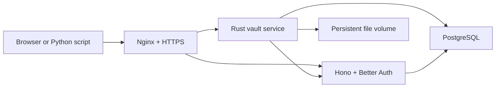

# Clipboard Vault

A lightweight, self-hosted team vault for pasted text and arbitrary files.

The main application is a Rust/Axum server. A small Hono service runs Better Auth for
Google login, password login, account approvals, workspaces, and API keys. PostgreSQL
stores searchable metadata; file bytes stay on a persistent VPS volume.

## What it does

- Manual paste composer with text, code, HTML, and URL detection.
- Arbitrary streamed file uploads without loading the whole file into memory.
- Private workspaces with owner, admin, and member roles.
- Global approval queue for every new account.
- Google and password login through Better Auth.
- Workspace API keys with read, write, and delete permissions.
- Ready-to-run Python file uploader.
- Trash, restore, search, tags, exports, and activity records.
- Docker Compose, Nginx, Certbot, health checks, backups, and GitHub Actions.

Clipboard Vault never reads the browser clipboard. The only clipboard operation is an
explicit Copy button clicked by the user.

## Architecture



Only Nginx exposes ports 80 and 443. The Rust, authentication, and database services
communicate through a private Docker network.

## Quick start

Requirements:

- Docker Engine with the Docker Compose plugin.
- A domain name for production Google login and HTTPS.
- Google OAuth credentials if Google login is enabled.

```bash
cp .env.example .env
# Edit .env and replace every placeholder.
docker compose up --build
```

For password-only local testing, set `DOMAIN=localhost` and
`PUBLIC_BASE_URL=http://localhost` in `.env`, then open `http://localhost`. The first registered user
must visit `/setup` and enter `BOOTSTRAP_TOKEN`. After that succeeds, the setup
route refuses all future claims.

Generate independent secrets with:

```bash
openssl rand -hex 32
```

Run that command separately for `POSTGRES_PASSWORD`, `BETTER_AUTH_SECRET`,
`AUTH_BRIDGE_SECRET`, and `BOOTSTRAP_TOKEN`. Never commit the resulting
`.env` file. Hex output is intentional: it is safe inside the PostgreSQL connection URL.

For a real VPS, follow [DEPLOYMENT.md](DEPLOYMENT.md).

## Google authentication

In Google Cloud Console:

1. Create or select a project.
2. Open APIs & Services, then Credentials.
3. Create an OAuth client ID with application type Web application.
4. Add this exact authorized redirect URI:

```text
https://vault.your-domain.com/api/auth/callback/google
```

5. Put the client ID and secret into the private VPS `.env`:

```dotenv
GOOGLE_CLIENT_ID=...
GOOGLE_CLIENT_SECRET=...
PUBLIC_BASE_URL=https://vault.your-domain.com
DOMAIN=vault.your-domain.com
```

The URL scheme, hostname, path, and trailing slash must match exactly. Google production
callbacks require HTTPS and normally cannot use a raw VPS IP address.

## Accounts and workspaces

- Registration creates a pending account and a session with no vault access.
- A global admin approves or rejects the account.
- Approval creates the user’s personal workspace.
- Workspace owners and admins create private invitation links.
- Owners control limits, members, ownership transfer, and deletion; admins control limits,
  non-owner members, items, and all workspace keys.
- Invited users still need global approval.
- Invitation links are stored as hashes, work once, and expire after 48 hours.
- No email service runs. A global admin can create a one-time password-reset link and send
  it to the user manually.

The first admin is protected by the private `BOOTSTRAP_TOKEN`. Choose a random value,
register the intended account, visit `/setup`, and claim the instance before sharing
the site.

## API keys

Open Keys & team inside a workspace. Create a named key, choose its expiration and optional
permissions, then copy it immediately. The complete key is shown once.

The key decides the workspace. Scripts cannot submit another workspace ID.

### Paste text

```bash
curl -X POST "https://vault.example.com/api/v1/items" \
  -H "Authorization: Bearer cv_live_REPLACE_ME" \
  -H "Content-Type: application/json" \
  -d '{
    "payload": "fn main() { println!(\"hello\"); }",
    "type": "auto",
    "virtual_path": "/snippets/rust",
    "tags": ["rust", "example"]
  }'
```

### Upload a file

```bash
curl -X POST "https://vault.example.com/api/v1/items" \
  -H "X-API-Key: cv_live_REPLACE_ME" \
  -F "file=@./report.pdf" \
  -F "virtual_path=/reports/2026" \
  -F 'tags=["report","monthly"]'
```

Both `Authorization: Bearer` and `X-API-Key` are supported.

Soft-deleted items are listed with `GET /api/v1/items?trash=true`, restored with
`POST /api/v1/items/{id}/restore`, and permanently removed with
`POST /api/v1/items/{id}/purge`.

### Python uploader

```bash
python -m pip install requests
python examples/upload_file.py ./report.pdf \
  --server https://vault.example.com \
  --api-key cv_live_REPLACE_ME \
  --path /reports/2026 \
  --tag report --tag monthly
```

The API returns a consistent error body:

```json
{
  "error": {
    "code": "PAYLOAD_TOO_LARGE",
    "message": "upload exceeds the allowed size",
    "detail": { "received": 120000000, "limit": 104857600 }
  }
}
```

### API route summary

| Method | Route | Purpose |
| --- | --- | --- |
| `POST` | `/api/v1/items` | Create pasted JSON content or upload one multipart file |
| `GET` | `/api/v1/items` | List/search active items; add `trash=true` for trash |
| `GET/PATCH/DELETE` | `/api/v1/items/{id}` | Read, edit metadata, or move an item to trash |
| `POST` | `/api/v1/items/{id}/restore` | Restore a trashed item |
| `POST` | `/api/v1/items/{id}/purge` | Permanently remove a trashed item and unreferenced bytes |
| `GET` | `/api/v1/items/{id}/content` | Stream stored file bytes |
| `GET` | `/api/v1/items/export?format=json|csv` | Export active item metadata and text |
| `GET` | `/api/v1/tags` | List workspace tags |
| `GET` | `/health/live`, `/health/ready` | Process and dependency health |

## Development checks

```bash
cargo fmt --all -- --check
cargo clippy --all-targets --all-features -- -D warnings
cargo test
cd auth && pnpm install && pnpm typecheck && pnpm build
python -m pytest -q tests
```

On Windows, local Rust compilation needs a compatible linker. It is not necessary to install
Visual Studio if development and builds are performed inside Linux, Docker, WSL, CI, or the
VPS. Production images compile Rust inside the official Linux Rust container.

## Documentation

- [VPS deployment, HTTPS, backups, upgrades, and recovery](DEPLOYMENT.md)
- [Security model and reporting](SECURITY.md)
- [.env configuration template](.env.example)

## License

MIT
